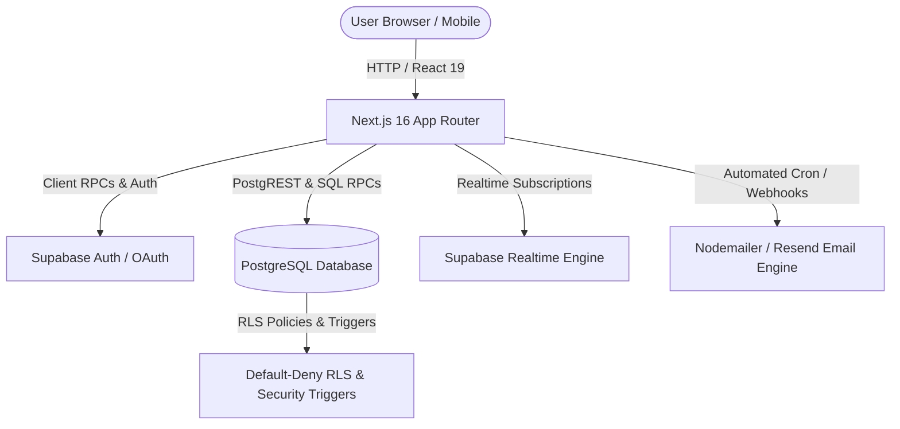

<div align="center">

# ⚡ HackerMate
### The Operating System for Hackathon Teams & Builders

[](https://nextjs.org/)
[](https://supabase.com/)
[](https://tailwindcss.com/)
[](https://www.typescriptlang.org/)
[](LICENSE)

*Discover open hackathons, match with compatible builders, assemble high-performing teams, and collaborate in real-time.*

[Explore Platform](#-key-features) • [Quickstart](#-quickstart) • [Architecture](#-architecture) • [Database & Security](#-database--security-architecture) • [Routes Matrix](#-canonical-route-precision)

---

</div>

## 🌟 Overview

**HackerMate** is an all-in-one team-building and hackathon workspace platform. Designed for developers, designers, product managers, and organizers, HackerMate solves the fragmented hackathon experience by offering automated builder matching, partner portals, multi-track registration management, real-time team workspaces, and verified SPOC team export tools.

> [!IMPORTANT]
> **Production-Grade Security**: HackerMate enforces strict Default-Deny UI controls, database Row-Level Security (RLS), advisory locks, rate-limiting, and automated community safety content filters across all messaging and team management RPCs.

---

## ⚡ Key Features

### 🔍 1. Builder Discovery & Matching Engine
- **Algorithmic Matchmaking**: Matches builders based on tech stack, skills, college/university, and hackathon goals.
- **Builder Spotlight**: Filter and connect with top platform builders or peers from your institution.
- **Connection Requests**: In-app networking system with optional custom introductory notes.

### 💬 2. Real-Time Team Workspaces & DMs
- **Shared Team Chat & Direct Messaging**: Unified chat interface powered by Supabase Realtime subscriptions.
- **Message Replies & Quoted Cards**: Instant message reply context (`reply_to_id`) with smooth jump-scrolling (`#msg-<id>`).
- **`@Mentions` & Pinned Messages**: Pin critical resources (Figma, GitHub repos) and notify teammates directly in chat.
- **Quick Team Invites**: Send 1-click team invitation cards directly inside DM conversations.

### 🎪 3. Partner Portals & Multi-Track Hackathons
- **Dedicated Partner Pages**: Custom branded hubs for premier partner hackathons (e.g. Morrow 1.0, Axcentra, Gamnexis).
- **Multi-Event Track Selector**: Register and filter teams by specific hackathon tracks (e.g. AI/ML, Web3, FinTech).
- **Partner Banner Carousel**: Dynamic homepage and portal carousel highlighting active national hackathons.

### 📄 4. SIH Export & Team Management
- **Smart India Hackathon (SIH) Workflow**: Export team data to formatted Excel / PDF rosters for SPOC validation.
- **Strict Role-Based Access**: SPOC exports and member modifications are locked strictly behind `(isMember || isOwner)` security checks.

### 🔔 5. Touch-Optimized Notifications & Digest Engine
- **In-App Notification Center**: Mobile touch-optimized notifications for friend requests, team invites, and join requests.
- **Automated Email Reports**: Cron-driven daily summaries, reminder webhooks, and organizer outreach tools.

---

## 🏗️ Architecture

HackerMate is built using a modern serverless full-stack architecture:



### Tech Stack Breakdown

| Layer | Technologies |
| :--- | :--- |
| **Frontend Framework** | [Next.js 16](https://nextjs.org/) (App Router, React 19, Server & Client Components) |
| **Styling & UI** | [Tailwind CSS v4](https://tailwindcss.com/), Vanilla CSS Variables, Lucide & Heroicons |
| **Backend & DB** | [Supabase](https://supabase.com/) (PostgreSQL 15+, Supabase Auth, Storage, Realtime) |
| **State & Hooks** | React State, Context API (`NotificationContext`), Custom Supabase Realtime Channels |
| **Tooling & Build** | TypeScript 5, ESLint, PostHog Analytics, Node.js 20+ |

---

## 📁 Project Structure Map

```text
HackerMate_Backup/
├── frontend/
│   ├── src/
│   │   ├── app/                      # Next.js App Router Pages & APIs
│   │   │   ├── admin/                # Platform Admin Dashboard
│   │   │   ├── connections/          # Builder Network & Friend Requests
│   │   │   ├── dashboard/            # Core User Operating Dashboard
│   │   │   ├── developers/           # Builder Search & Spotlight Directory
│   │   │   ├── hackathons/           # Hackathons Index, SIH Hub, & Details
│   │   │   ├── invites/              # Pending Team Invites Hub
│   │   │   ├── messages/             # Personal DMs & Inbox
│   │   │   ├── notifications/        # Touch-Optimized In-App Notifications
│   │   │   ├── onboarding/           # Builder Profile Creation Flow
│   │   │   ├── partners/[slug]/      # Dynamic Partner Hackathon Hubs
│   │   │   ├── profile/[id]/         # Builder Public Profiles & Portfolios
│   │   │   ├── teams/[id]/           # Team Overview & Live Workspace
│   │   │   └── api/                  # Serverless Webhooks & Cron Routes
│   │   ├── components/               # Reusable UI Components
│   │   │   ├── chatThread.tsx        # Shared DM & Team Workspace Chat Thread
│   │   │   ├── Navbar.tsx            # Global Navigation Bar & Unread Badges
│   │   │   ├── PartnerBannerCarousel.tsx # Homepage Hackathon Carousel
│   │   │   └── TeamOverviewView.tsx  # Team Overview & RLS Guarded Actions
│   │   ├── context/                  # Notification & UI Context Providers
│   │   ├── lib/                      # Supabase Client, Safety Filters, & Export Helpers
│   │   └── types/                    # TypeScript Database Schemas & Interfaces
│   └── supabase/
│       └── migrations/               # Transactional Database Migrations (SQL)
```

---

## 🚀 Quickstart

### Prerequisites

- **Node.js**: `v20.0.0` or higher
- **Package Manager**: `npm` v10+
- **Supabase Account**: A live Supabase project with PostgreSQL database and Auth enabled.

### 1. Repository Setup

```bash
# Clone the repository
git clone https://github.com/your-username/HackerMate.git
cd HackerMate/frontend
```

### 2. Environment Configuration

Create a `.env.local` file inside the `frontend/` directory with your public Supabase credentials:

```env
# Required Supabase Credentials
NEXT_PUBLIC_SUPABASE_URL=https://your-project-ref.supabase.co
NEXT_PUBLIC_SUPABASE_ANON_KEY=your-supabase-anon-key

# Optional Analytics & Outreach Keys
NEXT_PUBLIC_POSTHOG_KEY=your-posthog-key
NEXT_PUBLIC_POSTHOG_HOST=https://app.posthog.com
```

### 3. Install Dependencies & Start Server

```bash
# Install NPM dependencies
npm install

# Launch Next.js local development server
npm run dev
```

Open [http://localhost:3000](http://localhost:3000) in your browser to view the application.

---

## 🗄️ Database & Security Architecture

HackerMate uses transactional PostgreSQL migrations located in `frontend/supabase/migrations/`.

> [!WARNING]
> **Database Security Prerequisites**: Before serving production traffic, apply all database security migrations using the Supabase CLI:

```bash
# Link project to your Supabase instance
supabase link --project-ref <your-project-ref>

# Push database schema & RLS policies
supabase db push
```

### Core Migration Files

- `202607020001_core_security.sql`: Core security policies, default-deny UI functions, and team RPCs.
- `202607260001_axcentra_and_partner_engine.sql`: Partner portal configuration tables and multi-track hackathon support.
- `202608040001_morrow_partner_page.sql`: Morrow 1.0 partner page metadata and hackathon integration.
- `202608040002_add_metadata_to_hackathon_registrations.sql`: Track selection metadata support for multi-track events.
- `202608040003_add_reply_to_id_to_messages.sql`: Database support for threaded message replies.
- `202608040004_fix_send_message_overloads.sql`: Canonical single-signature RPC optimization for PostgREST.

---

## 📍 Canonical Route Precision

Always follow canonical route conventions when building features or adding navigation links:

| Entity | Canonical Route Format | Example |
| :--- | :--- | :--- |
| **User Profile** | `/profile/[id]` | `/profile/44067b2e-3c82-4502-8398-4ba8d1b91022` |
| **Team Overview** | `/teams/[id]` | `/teams/a1b2c3d4-e5f6-7890-abcd-1234567890ab` |
| **Team Workspace** | `/teams/[id]/workspace` | `/teams/a1b2c3d4-e5f6-7890-abcd-1234567890ab/workspace` |
| **Hackathon Details** | `/hackathons/[id]` | `/hackathons/sih` or `/hackathons/[uuid]` |
| **Partner Portal** | `/partners/[slug]` | `/partners/morrow` or `/partners/axcentra` |
| **Invites Hub** | `/invites` | `/invites` |
| **Network & Connections** | `/connections` | `/connections` |

---

## 🧪 Validation & Typechecking

Run automated TypeScript typechecks and production build validations:

```bash
# TypeScript compilation check (0 errors standard)
npx tsc --noEmit

# ESLint check
npm run lint

# Production Next.js build check
npm run build
```

---

## 📄 License

Distributed under the MIT License. See `LICENSE` for more information.

<div align="center">

**Built with ❤️ for hackathon builders worldwide.**

</div>
