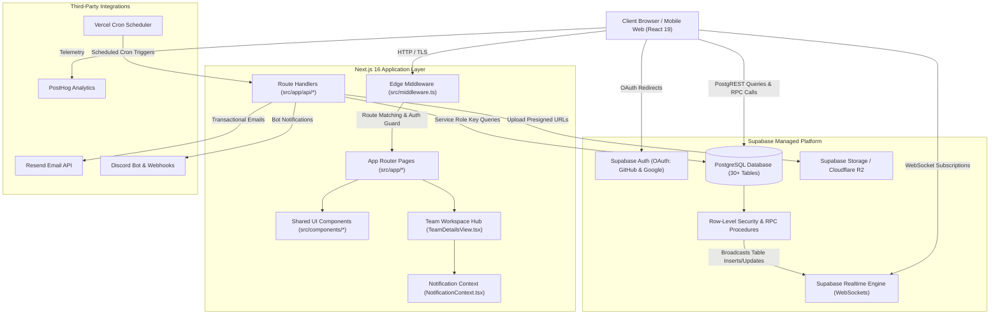

<!-- generated-by: gsd-doc-writer -->
# Architecture Overview

HackerMate is an all-in-one team-building and hackathon collaboration platform designed for engineering students, organizers, and builders across India. The system is architected as a serverless full-stack web application utilizing the Next.js 16 App Router on the frontend and Supabase (PostgreSQL 15+, Supabase Auth, Storage, and Realtime engine) on the backend. Its primary architectural pattern is a layered, client-augmented serverless architecture where Next.js delivers React 19 Server and Client Components while data security, permissions, and real-time state synchronization are offloaded to PostgreSQL Row-Level Security (RLS) policies and transaction-safe Stored Procedures (`SECURITY DEFINER` RPCs).

---

## Component Diagram

The following diagram illustrates the primary modules of HackerMate and their bidirectional interaction flows:



---

## Data Flow

Data flows through distinct paths depending on whether the operation is user authentication, real-time collaboration, team management, or automated background processing.

### 1. User Authentication & Onboarding
1. The user initiates OAuth authentication via GitHub or Google from `AuthModal.tsx` or `/login`.
2. Supabase Auth processes the provider token and redirects back to `/auth/callback`.
3. The serverless route handler in `src/app/auth/callback/route.ts` exchanges the authorization code for a session token and synchronizes cookies.
4. Edge middleware (`src/middleware.ts`) inspects incoming requests. If the user's `profiles` record has `onboarding_completed: false`, the user is redirected to `/onboarding` to complete college affiliation, skill selections, and hackathon experience.
5. On completion, the profile is saved and the user is routed to `/dashboard`.

### 2. Real-Time Team Chat & Threaded Messaging
1. A team member opens the team workspace at `/teams/[id]` or user DM at `/messages`.
2. `chatThread.tsx` mounts and initializes a Supabase Realtime channel listening to `postgres_changes` on the `messages` table filtered by `conversation_id`.
3. When the user sends a message:
   - Client-side profanity filtering and URL safety checks run through `src/lib/safety.ts`.
   - The message payload (including optional `reply_to_id` and `@mentions` UUID array) is written to the database via PostgREST or `send_message` RPC.
   - Database security policies ensure the caller is an active participant in `conversation_participants`.
4. PostgreSQL emits the change event across the replication stream to Supabase Realtime.
5. Connected clients receive the payload via WebSocket, appending the message and triggering jump-scroll or notification badges without full-page reloads.

### 3. Team Applications & Join Request Workflow
1. A prospective builder navigates to `/teams` or `/teams/[id]` and submits a join request.
2. The client invokes the `request_to_join_team(p_team_id, p_message)` stored procedure.
3. The procedure checks recruiting status, records the application in `team_join_requests`, and triggers an in-app deep-link notification for the team owner.
4. The team owner reviews pending applicants at `/teams/[id]/requests`.
5. Upon approval via `accept_team_join_request(...)`, the procedure atomically updates the request status, adds the applicant to `team_members`, provisions conversation access, and increments the team size.

### 4. Scheduled Jobs & Cron Processing
1. Vercel Cron triggers endpoints in `src/app/api/cron/*` according to schedules defined in `frontend/vercel.json`.
2. The endpoint verifies the `Authorization: Bearer <CRON_SECRET>` header to reject unauthorized requests.
3. Using an elevated `SUPABASE_SERVICE_ROLE_KEY` client, the handler queries impending hackathon deadlines or inactive leads.
4. Outbound email notifications are assembled via `src/lib/emailTemplate.ts` and dispatched through the Resend API.

---

## Key Abstractions

The following core modules and abstractions define system behaviors and contracts:

| Abstraction / File | Type / Responsibility | Primary Location |
| :--- | :--- | :--- |
| **Browser Supabase Client** | Configures browser PostgREST client with development-mode RLS violation interceptor (`WrapWithRlsInterceptor`) | `frontend/src/lib/supabase.ts` |
| **Edge Route Guard** | Next.js Edge Middleware protecting authenticated routes, team workspaces, and enforcing admin role restrictions | `frontend/src/middleware.ts` |
| **Notification System** | Global React Context (`NotificationContext`) managing touch-optimized toasts, alert feeds, and modal confirmations | `frontend/src/context/NotificationContext.tsx` |
| **Team Workspace Engine** | Unified tabbed workspace orchestrating overview, Kanban tasks, documents, link bookmarks, submissions, and deployments | `frontend/src/components/TeamDetailsView.tsx` |
| **Realtime Chat Thread** | Resilient WebSocket message feed supporting replies, message quoting, pinned resources, and mentions | `frontend/src/components/chatThread.tsx` |
| **Safety & Moderation** | Regular-expression profanity masking and domain verification rules for external URL attachments | `frontend/src/lib/safety.ts` |
| **Institutional Directory** | Canonical registry of verified Indian universities and engineering institutes for student matching | `frontend/src/lib/colleges.ts` |
| **Database Type Definitions** | Strongly-typed TypeScript interfaces mapping directly to 30+ Supabase tables and stored procedure signatures | `frontend/src/types/supabase.ts` |

---

## Directory Structure Rationale

The repository is structured to maintain a clean separation between application presentation, edge routing, transactional business logic, and database migrations:

```text
HackerMate_Backup/
├── frontend/                     # Next.js web application root
│   ├── src/
│   │   ├── app/                  # Next.js App Router route hierarchy
│   │   │   ├── (public)/         # Landing page, contact, terms, partner portals
│   │   │   ├── (auth)/           # Onboarding, dashboard, profile, team workspaces
│   │   │   ├── admin/            # Platform moderation and organizer lead CRM
│   │   │   ├── api/              # Serverless API routes (webhooks, cron, outreach)
│   │   │   ├── layout.tsx        # Root HTML layout, font injection, global providers
│   │   │   └── middleware.ts     # Edge authentication & role validation layer
│   │   ├── components/           # Modular, reusable React UI components
│   │   ├── context/              # Application-wide React context providers
│   │   ├── lib/                  # Shared utilities, client helpers, security filters
│   │   └── types/                # Generated Supabase types and custom interfaces
│   ├── supabase/
│   │   └── migrations/           # 66 atomic, version-controlled PostgreSQL migrations
│   ├── scripts/                  # Runtime verification harnesses and smoke tests
│   ├── public/                   # Static assets, branding graphics, and badges
│   ├── package.json              # App dependencies, scripts, and runtime engines
│   └── vercel.json               # Vercel deployment and cron job schedules
├── docs/                         # Technical architecture, API, and setup documentation
├── .agents/                      # Agent skills, design guidelines, and safety rules
├── PROJECT_CONTEXT.md            # Comprehensive project onboarding reference
├── README.md                     # High-level product overview and quickstart
└── AGENTS.md                     # Strict repository guidelines and safety invariants
```

### Directory Roles:
- **`frontend/src/app/`**: Implements canonical Next.js App Router file-based routing. Grouped by feature domain (`/teams`, `/developers`, `/hackathons`, `/partners/[slug]`) to mirror user-facing functionality.
- **`frontend/src/components/`**: Isolates presentational and client-interactive widgets from page loaders, enabling clean component reusability between mobile and desktop viewports.
- **`frontend/supabase/migrations/`**: Contains sequentially timestamped SQL migrations. All schema revisions, RLS policies, and triggers are maintained declaratively rather than modified through live database dashboards.
- **`frontend/scripts/`**: Houses independent smoke test and benchmark scripts (`smoke-test-core-pages.js`) for runtime permission verification without spinning up full browser test suites.
