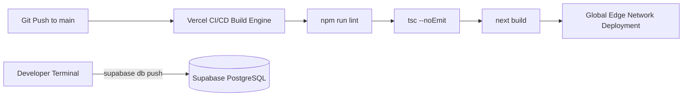

<!-- generated-by: gsd-doc-writer -->
# Deployment Guide

This guide details the production deployment architecture, build pipelines, environment provisioning, rollback procedures, and observability stack for HackerMate.

---

## Deployment Targets

HackerMate is designed for zero-maintenance serverless cloud operations across three primary cloud providers:

| Layer | Platform | Configuration File / Dashboard | Description |
| :--- | :--- | :--- | :--- |
| **Frontend & APIs** | [Vercel](https://vercel.com) | `frontend/vercel.json`, `.vercel/project.json` | Global edge network serving Next.js 16 App Router, React 19 SSR, Edge Middleware, and Serverless Route Handlers. |
| **Database & Auth** | [Supabase](https://supabase.com) | `frontend/supabase/migrations/` | Managed PostgreSQL 15+ instance (AWS ap-south-1 region <!-- VERIFY: Supabase Cloud Region -->), Supabase Auth, and Realtime WebSocket replication. |
| **Media & Decks** | [Cloudflare R2](https://www.cloudflare.com/developer-platform/r2/) | S3 API Credentials in `frontend/.env.local` | S3-compatible zero-egress bucket storing PDF pitch decks, certificates, and team submission archives. |

---

## Build Pipeline & Continuous Delivery

HackerMate utilizes continuous deployment connected to the project's GitHub repository:



### 1. Automated Vercel CI/CD Build
1. **Trigger**: A push or pull request to the `main` branch.
2. **Build Command**:
   ```bash
   npm run build
   ```
3. **Build Execution**:
   - Vercel installs dependencies with `npm install`.
   - Next.js compiles server and client bundles, treeshakes icon imports (`lucide-react`, `date-fns`), and verifies TypeScript types with `tsc --noEmit`.
   - Serverless functions and edge middlewares (`src/middleware.ts`) are packaged into Vercel Edge/Node runtimes.
4. **Deploy**: The compiled bundle is deployed to the production domains ([hackermate.in](https://hackermate.in) <!-- VERIFY: Custom Domain DNS --> and `hacker-mate-backup.vercel.app`).

### 2. Database Migration Pipeline
Database schema updates are managed separately from application code to preserve zero-downtime availability:
```bash
# Authenticate CLI with Supabase
supabase login

# Link repository to production Supabase project ref
supabase link --project-ref <your-project-ref>

# Execute pending migrations
supabase db push
```

---

## Environment Setup (Production)

Ensure the following production secrets are configured in the Vercel Project Settings (under **Settings > Environment Variables**):

### Required Production Secrets:
- `NEXT_PUBLIC_SUPABASE_URL`: Production Supabase HTTPS endpoint.
- `NEXT_PUBLIC_SUPABASE_ANON_KEY`: Public anonymous API key for client-side queries.
- `SUPABASE_SERVICE_ROLE_KEY`: Elevated administrative key for serverless endpoints and cron triggers.
- `CRON_SECRET`: High-entropy random string matching Vercel Cron authentication headers.
- `NOTIFICATION_WEBHOOK_SECRET`: Secret token securing incoming Supabase webhook requests.
- `RESEND_API_KEY`: Production transactional email sending key from Resend.
- `NEXT_PUBLIC_SITE_URL`: Set to `https://hackermate.in` (or your production domain).

*(Consult [CONFIGURATION.md](CONFIGURATION.md) for optional keys including Gemini API, Cloudflare R2, and Discord bot tokens.)*

---

## Rollback Procedure

### 1. Instant Application Rollback (Vercel)
If a software bug or build regression affects production traffic:
1. Open the [Vercel Project Dashboard](https://vercel.com).
2. Navigate to the **Deployments** tab.
3. Locate the most recent healthy deployment prior to the regression.
4. Click the three-dot action menu (`...`) on that deployment and select **Promote to Production**.
5. Vercel will instantly route edge traffic to the previous build without rebuilding from Git.

### 2. Database Schema Rollback
Because database migrations are applied transactionally:
1. Never run destructive SQL operations (`DROP TABLE`, `DROP COLUMN`) in migrations without a phased deprecation period.
2. If a migration must be reverted, write a new forward-compensating migration file in `frontend/supabase/migrations/` (e.g. `YYYYMMDDHHMM_revert_feature_x.sql`) and push it via `supabase db push`.

---

## Monitoring & Observability

HackerMate integrates multiple monitoring layers to ensure platform reliability:

1. **Vercel Analytics & Web Vitals**:
   - `@vercel/analytics` is embedded in `frontend/src/app/layout.tsx`.
   - Tracks Core Web Vitals (LCP, FID, CLS) and real-world user page response latencies.
2. **Product Telemetry (PostHog)**:
   - Configured via `NEXT_PUBLIC_POSTHOG_KEY` for client-side event tracking, user journeys, and funnel conversions.
3. **Database Health & Telemetry**:
   - Monitor query latency, connection pooler utilization, and PostgreSQL memory usage directly within the Supabase Cloud dashboard.
   - Real-time RLS violation alerts are logged to server output when code `42501` is triggered.
4. **Email Delivery Telemetry (Resend)**:
   - Resend dashboard tracks delivery rates, spam flags, and bounce rates.
   - Inbound webhook endpoint `/api/webhooks/resend` automatically syncs email status to the database.
